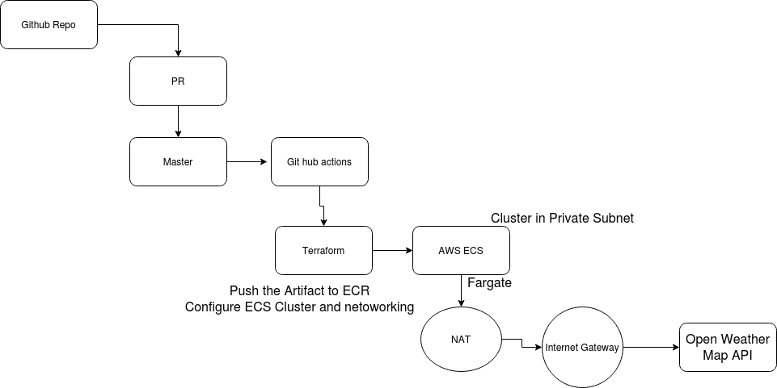

# Goal
> Create a Microservice which gives weather related information for any location

# Description
> Following operations are available withe this service:
- Get current weather information of a city
- Get historical weather data of a city searched by the user 

# Technology Stack
> Following are the key technologies and frameworks used in this microservice:
- Java 8
- J2ee
- Spring Framework
- Spring Cloud
- Spring Boot
- Spring Data JPA
- Junit
- PowerMock
- H2 Database
- Swagger UI
- Maven
- Hysterix

# API Documentation
> After running the micro-service as Spring boot application , please refer to swagger-UI screen [http://localhost:8080/swagger-ui.html]

# Developer Setup
- Clone the git hub repositroy and import the project as a maven project in your IDE
- Create your account on Open Weather Map and api key in the application properties file
- Build the service as maven build by executing all the test cases
- Run it as a Spring boot application

# Approach of development
- Setting up the git repo and required dependencies of the project.
- API Design of current weather data and historical data operations
- Wrriten business interfaces for fetching weather information
- Created a different component for core classes that can be used across all APIs and even in different microservice in future
- Create a different component for Weather data provider so that it can be seperate from the actual business code
- Exception handling and Internationalisation support
- Introduct Fascade design pattern for getting current weather data from different external provider. 
- Writing integrtion and unit test cases
- Documentation

# Key Package information
- ##### com.weatherservice.apicore.* : 
    - Classes that handles cross cutting concents like 
        -  exception handling 
        -  internationalisation
    - Common API Response and Error classes

- ##### com.weatherservice.controller : 
    -  Controller classes for weather operations
- ##### com.weatherservice.service : 
    -  Business layer for weather operation
- ##### com.weatherservice.repository : 
    -  Repository layer for weather operation
- ##### com.weatherservice.util : 
    -  Utility layer

- ##### com.weatherservice.provider.* : 
    -  Provider component where classes for provider like open weather map etc are created

# Deployment Strategy

<pre>
  
</pre>

# Future Technical Goals
-  Authentication and Authroization mechanism with  OAuth2.0
-  Distributed Caching of weather information searched in our system

